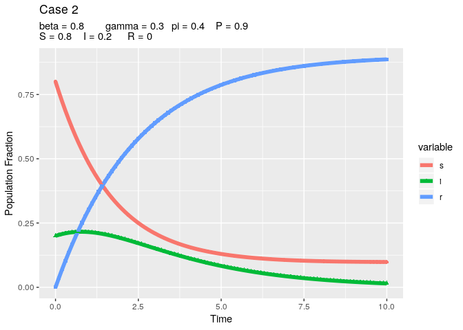

SIR epidemic model with constant vaccination
================

This document will attempt to code the Makinde 2007 SIR model.

> Makinde, O. D. (2007). Adomian decomposition approach to a SIR
> epidemic model with constant vaccination strategy. Applied Mathematics
> and Computation, 184(2), 842–848.
> [doi:10.1016/j.amc.2006.06.074](https://doi.org/10.1016/j.amc.2006.06.074)

``` r
library(deSolve)
library(reshape2)
library(ggplot2)
```

So, the following equations were specified where *P* is the vaccination
rate:

\[
\frac{ds}{dt} = (1-P)\pi - \beta si - \pi s
\]

\[
\frac{di}{dt} = \beta si - (\gamma i - \pi)i
\]

\[
\frac{dr}{dt} = P\pi + \gamma i - \pi r
\]

``` r
sir_ode <- function(times, init, params){
  with(as.list(c(params, init)), {
         dS <- (1-P)*p - beta*s*i - p*s
         dI <- beta*s*i - (gamma + p)*i
         dR <- P*p + gamma*i - p*r
         list(c(dS, dI, dR))
  })
}
```

## Case 1: \(E_0\) stable (disease eradication)

``` r
params  <- c(beta = 0.8, gamma = 0.03, p = 0.4, P = 0.9)
init    <- c(s = 1, i = 0, r = 0)
times   <- seq(0, 10, length.out = 101)
sir_out <- lsoda(init, times, sir_ode, params)
```

``` r
sir_out_long <- reshape2::melt(as.data.frame(sir_out), "time")
ggplot(sir_out_long, aes(x = time, y = value, group = variable, color = variable)) +
  geom_line(lwd = 2) +
  geom_point(aes(pch = variable)) +
  labs(list(
    title = "Case 1",
    subtitle = paste("beta = 0.8, gamma = 0.3, pi = 0.4, P = 0.9",
                     "S = 1, I = 0, R = 0", sep = "\n"),
    x = "Time",
    y = "Population Fraction"
  ))
```

<!-- -->

## Case 2: \(E_0\) stable (disease eradication)

The only difference between this and case 1 is the initialzation of the
SIR parameters:

``` r
params  <- c(beta = 0.8, gamma = 0.03, p = 0.4, P = 0.9)
init    <- c(s = 0.8, i = 0.2, r = 0)
times   <- seq(0, 10, length.out = 101)
sir_out <- lsoda(init, times, sir_ode, params)
```

``` r
sir_out_long <- reshape2::melt(as.data.frame(sir_out), "time")
ggplot(sir_out_long, aes(x = time, y = value, group = variable, color = variable)) +
  geom_line(lwd = 2) +
  geom_point(aes(pch = variable)) +
  labs(list(
    title = "Case 2",
    subtitle = paste("beta = 0.8\tgamma = 0.3\tpi = 0.4\tP = 0.9",
                     "S = 0.8\tI = 0.2\tR = 0", sep = "\n"),
    x = "Time",
    y = "Population Fraction"
  ))
```

<!-- -->

## Case 3: \(E_u\) stable (no eradication)

The only difference between this and case 2 is the vaccination rate,
*P*.

``` r
params  <- c(beta = 0.8, gamma = 0.03, p = 0.4, P = 0.3)
init    <- c(s = 0.8, i = 0.2, r = 0)
times   <- seq(0, 10, length.out = 101)
sir_out <- lsoda(init, times, sir_ode, params)
```

``` r
sir_out_long <- reshape2::melt(as.data.frame(sir_out), "time")
ggplot(sir_out_long, aes(x = time, y = value, group = variable, color = variable)) +
  geom_line(lwd = 2) +
  geom_point(aes(pch = variable)) +
  labs(list(
    title = "Case 3",
    subtitle = paste("beta = 0.8\tgamma = 0.3\tpi = 0.4\tP = 0.3",
                     "S = 0.8\tI = 0.2\tR = 0", sep = "\n"),
    x = "Time",
    y = "Population Fraction"
  ))
```

<!-- -->

## Case 4: \(E_u\) stable (no eradication)

This is one where there is no vaccination whatsoever

``` r
params  <- c(beta = 0.8, gamma = 0.03, p = 0.4, P = 0)
init    <- c(s = 0.8, i = 0.2, r = 0)
times   <- seq(0, 10, length.out = 101)
sir_out <- lsoda(init, times, sir_ode, params)
```

``` r
sir_out_long <- reshape2::melt(as.data.frame(sir_out), "time")
ggplot(sir_out_long, aes(x = time, y = value, group = variable, color = variable)) +
  geom_line(lwd = 2) +
  geom_point(aes(pch = variable)) +
  labs(list(
    title = "Case 4",
    subtitle = paste("beta = 0.8\tgamma = 0.3\tpi = 0.4\tP = 0",
                     "S = 0.8\tI = 0.2\tR = 0", sep = "\n"),
    x = "Time",
    y = "Population Fraction"
  ))
```

<!-- -->
